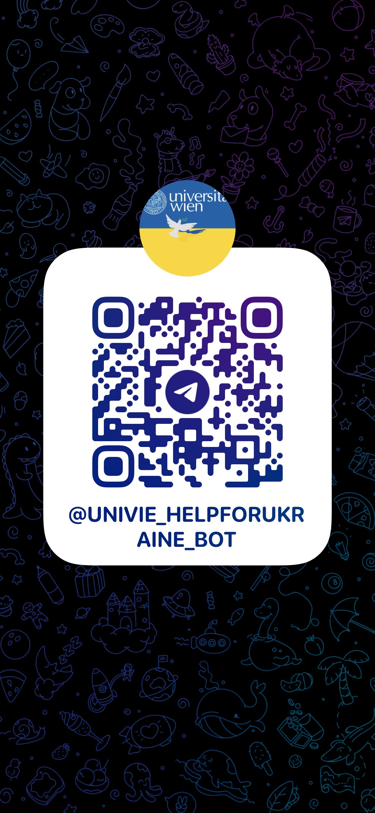
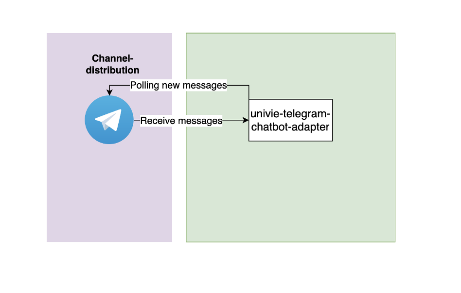

# Telegram-adapter service

## Specification

**PR1: Ukrainian Student Refugees Bot**

- Context: Currently, UNIVIE is implementing an information desk for Ukrainian refugee students who are interested in following her studies here in Vienna at least for the next months.
- Task: Implement a chatbot for a first orientation, answering FAQs and advising the students on support offers.

## Live demo

https://t.me/univie_helpforukraine_bot

## architecture

## Upcoming challenges

## License

[MIT licensed](LICENSE).
